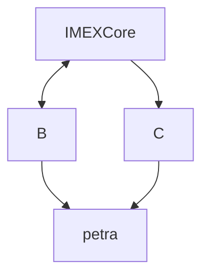

## Environments 

#### Schema application involved

Here is a simple flow chart:

| Applications | composants | A | B | C |
| :---: | :---: | :---: | :---: | :---: |
| allNETT | JBOSS (Java Ear) Linux | Windows server | Oracle (OCP) | --- |
| Imex Europe Core Zos| CICS Programs/transactions | DB2 | Websphere(IMEX Java Ear) | Websphere(IMEX Viever Java Ear) |
| Imex Asie Core Zos| CICS Programs/transactions | DB2 | Websphere(IMEX Java Ear) | Websphere(IMEX Viever Java Ear) |
| **PETRA Webservice** _LIMITcheck_ | CICS Programs | Java Jar | --- |  --- |
| **PETRA Webservice** *GEDListerPiecesJointes* | CICS Programs | Java Jar | --- |  --- |
| **PETRA Webservice** *GEDLRecheidentiTiers* | CICS Programs | Java Jar | --- |  --- |

| **PETRA Batch input** *IMEX Europe* | Batch Cobol Programs | Petra DB2 |  --- |  --- |
| **PETRA Batch input** *IMEX Asie* | Batch Cobol Programs | Petra DB2 |  --- |  --- |
| **PETRA Batch ouput** IMEX Europe | CRE, CRI, 3D, Reports etc... | --- |  --- |  --- |
| **PETRA Batch ouput** IMEX Europe | CRE, CRI, 3D, Reports etc... | --- |  --- |  --- |

| **PETRA BOX** | CICS Transactions/Programs | DB2 | MQ | --- |

| **EDITRADE Webservice** *GEDPostDocument* | CICS Programs | Java Jar | --- |  --- |
| **EDITRADE Webservice** *GEDGetDocument* | CICS Programs | Java Jar | --- |  --- |