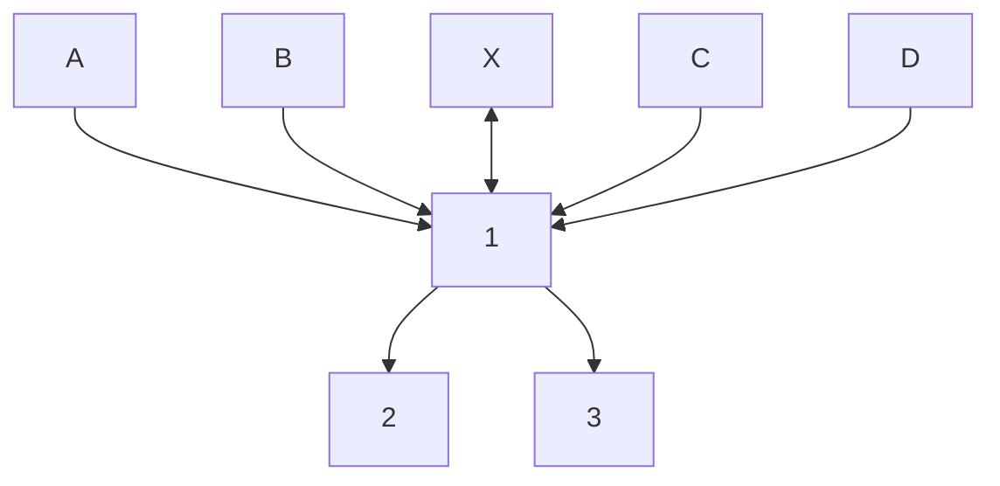
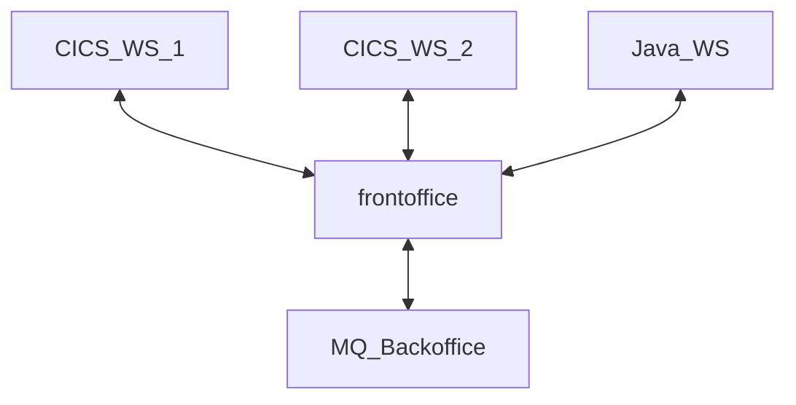

#mermaid diagram

Here is a simple flow chart:



Here is a second simple flow chart:


#table

| blabla | bliblibli | bloubloublpou | etpuisquoi | amityville |
| :---: | :---: | :---: | :---: | :---: |
| aaaaa | sdsqdqsdq | dsqdsqdsqdsqd | Oracle  | --- |
| dqdsqdsqddc | sdsdsdsd | nosql | tomcat | jjjjjkkj |


bon sinon tout va bien

```
bon sinon tout va bien :)
```
sequenceDiagram
    Alice->>John: Hello John, how are you?
    John-->>Alice: Great!
    Alice-)John: See you later!

---
title: Animal example
---
classDiagram
    note "From Duck till Zebra"
    Animal <|-- Duck
    note for Duck "can fly\ncan swim\ncan dive\ncan help in debugging"
    Animal <|-- Fish
    Animal <|-- Zebra
    Animal : +int age
    Animal : +String gender
    Animal: +isMammal()
    Animal: +mate()
    class Duck{
        +String beakColor
        +swim()
        +quack()
    }
    class Fish{
        -int sizeInFeet
        -canEat()
    }
    class Zebra{
        +bool is_wild
        +run()
    }

exemple de code 
`exemple de code` 

sequenceDiagram
    participant Alice
    participant Bob
    participant John
    Alice->>John: Hello John, how are you?
    loop Healthcheck
        John->>John: Fight against hypochondria
    end
    Note right of John: Rational thoughts <br/>prevail!
    John-->>Alice: Great!
    John->>Bob: How about you?
    Bob-->>John: Jolly good!
